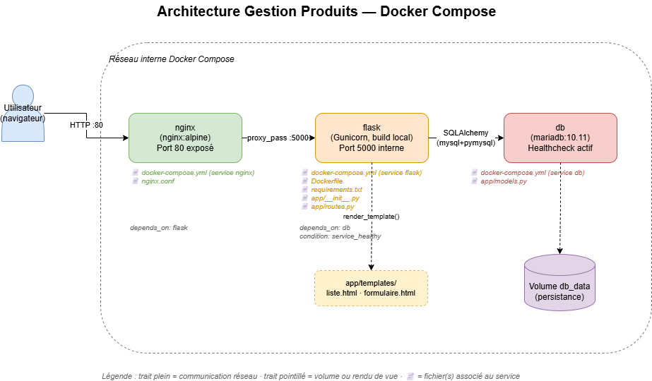

# Architecture

## Schéma général

L'application repose sur 3 conteneurs orchestrés par Docker Compose :

| Service | Rôle | Fichiers |
|---|---|---|
| `nginx` | Reverse proxy, point d'entrée HTTP (port 80) | `docker-compose.yml`, `nginx.conf` |
| `flask` | Application web (Gunicorn) | `Dockerfile`, `app/` |
| `db` | Base de données MariaDB | `docker-compose.yml` |

## Communication entre services

- `nginx` transmet les requêtes à `flask` via `proxy_pass http://flask:5000`
- `flask` se connecte à `db` via SQLAlchemy (`mysql+pymysql://...`)
- `flask` attend que `db` soit `healthy` avant de démarrer (`depends_on: condition: service_healthy`)

## Persistance

Les données MariaDB sont conservées dans le volume nommé `db_data`, indépendant du cycle de vie des conteneurs.