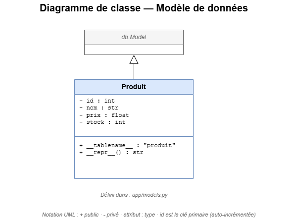

# Modèle de données

## Diagramme de classe

## Table `produit`

| Colonne | Type | Contraintes |
|---|---|---|
| `id` | Integer | Clé primaire, auto-incrémentée |
| `nom` | String(100) | Non nul |
| `prix` | Float | Non nul |
| `stock` | Integer | Non nul, défaut 0 |